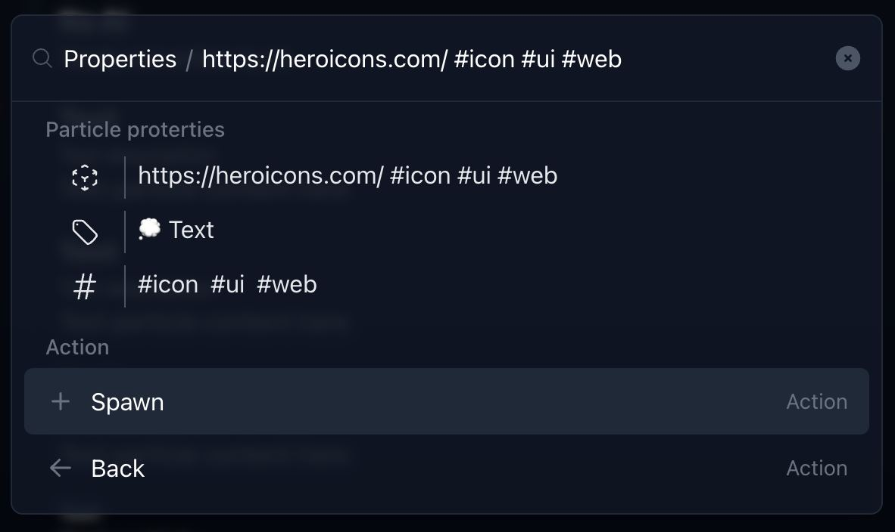
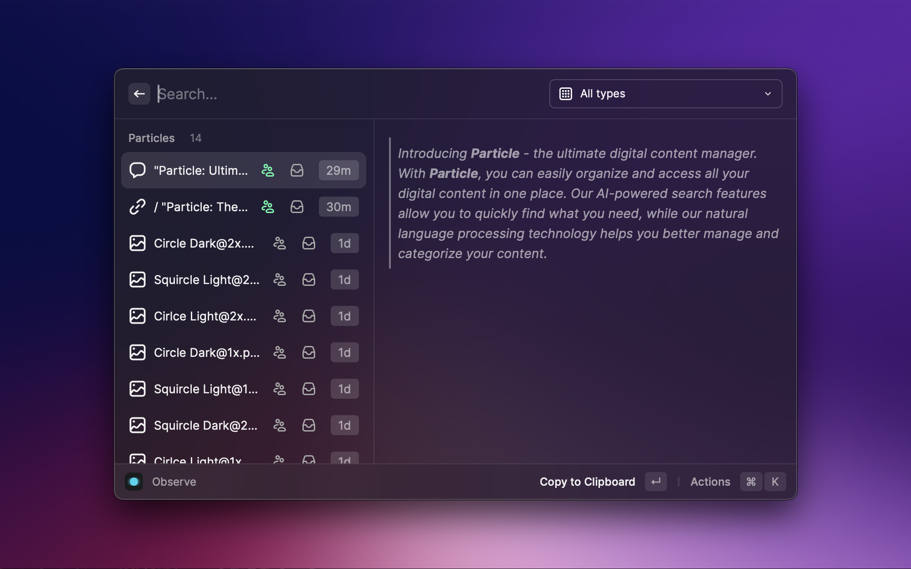
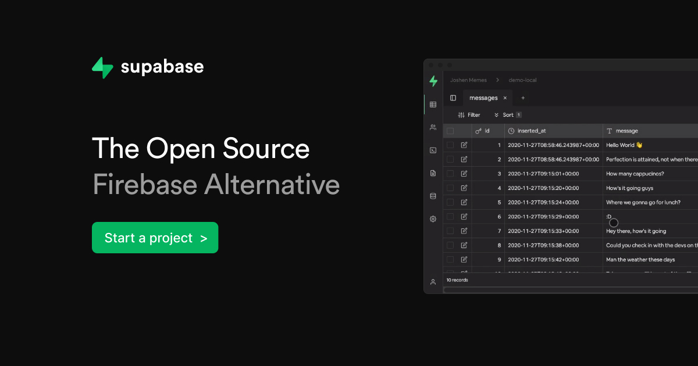

 

 

Introducing **Particle** - the ultimate digital content manager inspired by the **quantum universe**. With
Particle, you can easily organize and access all your digital content in
one place. Our AI-powered search features allow you to quickly find what
you need, while our custom model helps you better manage and categorize your content.

 

### 💡 Concepts - Spawning particles is our way of creating something new. With just a few keystrokes, you can create a link, an image, or a long text that you want to refer back to or keep track of.

- **Spawn** new links, images, and text particles.
- **Tag** them for easy retrieval later.
- Need to organize your **particles**? Use **entanglement**
- Make it **observable** publicly, or keep them private – your choice.
- Do not need to keep track of certain particles? **Archive** them.

 
 

### ✨ Bespoke Raycast Extension

Raycast is an excellent productivity tool, so we created a Particle extension specifically for it.

- Spawn new particles from your selections
- Observe and manage your particle universe
- Make them public or archive instantly from the extension

 
 

### 🪄 Magic of AI

Particle will act as your memory bank, just like the one Dumbledore had. But do not worry, no witchcraft or wizardry is involved - just the power of advanced AI.

- Title, description or any other particle metadata fields are generated with the help of AI
- Our AI understands the content, making it easier to find when needed.

 
 

### ⚡ Powered by Supabase

We have relied heavily on Supabase’s features as they have powered all of your essential services.

- **Database** - One of the most important ways that we have utilized Supabase is by using their platform to create our database schema. This has enabled us to design and implement a database structure that is both robust and scalable, allowing us to store and manage our data more effectively.
- **API** - Generating APIs directly from the database schema gave us access to a reliable and highly functional API.
- **Storage** - Storage API allows us to store and access media files quickly and securely. This ensures our users have easy access to their saved content without any delays or disruptions.
- **Authentication** - One of the hardest thing to implement right is authentication & authorization. Utilizing the authentication features made easy for us to employ various strategies.

 
 

  Crafted with &nbsp; 💚 &nbsp; by <a href="https://github.com/techyonx">Techyon</a>

